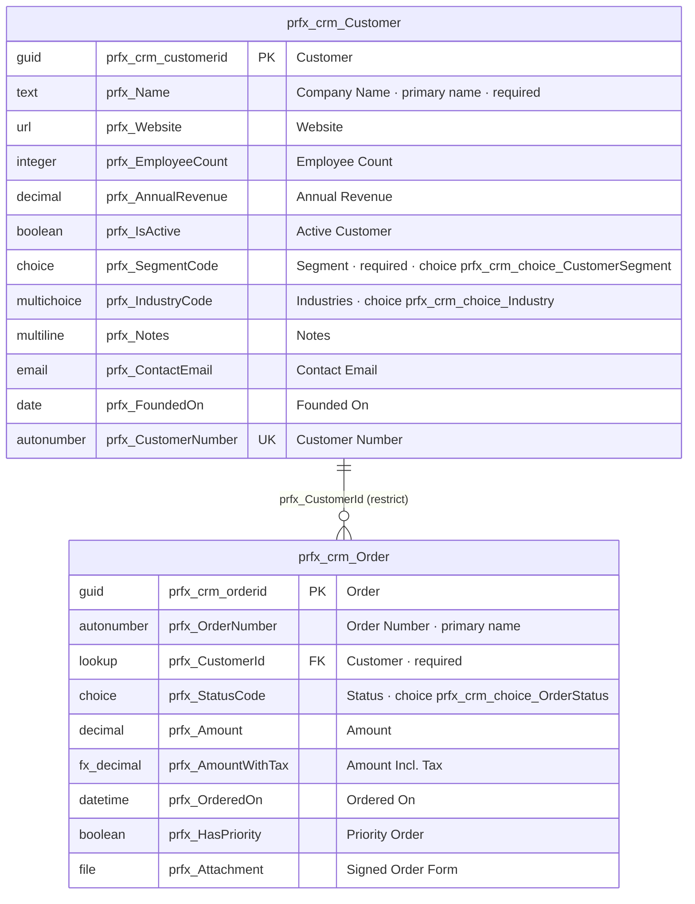

<!-- Generated by dv_metadata_docs.py from the *.dv.metadata.yaml model. Do not edit by hand. -->

# Entity relationship diagram

```mermaid
erDiagram
    prfx_crm_Customer {
        guid prfx_crm_customerid PK "Customer"
        text prfx_Name "Company Name · primary name · required"
        url prfx_Website "Website"
        integer prfx_EmployeeCount "Employee Count"
        decimal prfx_AnnualRevenue "Annual Revenue"
        boolean prfx_IsActive "Active Customer"
        choice prfx_SegmentCode "Segment · required · choice prfx_crm_choice_CustomerSegment"
        multichoice prfx_IndustryCode "Industries · choice prfx_crm_choice_Industry"
        multiline prfx_Notes "Notes"
        email prfx_ContactEmail "Contact Email"
        date prfx_FoundedOn "Founded On"
        autonumber prfx_CustomerNumber UK "Customer Number"
    }
    prfx_crm_Order {
        guid prfx_crm_orderid PK "Order"
        autonumber prfx_OrderNumber "Order Number · primary name"
        lookup prfx_CustomerId FK "Customer · required"
        choice prfx_StatusCode "Status · choice prfx_crm_choice_OrderStatus"
        decimal prfx_Amount "Amount"
        fx_decimal prfx_AmountWithTax "Amount Incl. Tax"
        datetime prfx_OrderedOn "Ordered On"
        boolean prfx_HasPriority "Priority Order"
        file prfx_Attachment "Signed Order Form"
    }
    prfx_crm_Customer ||--o{ prfx_crm_Order : "prfx_CustomerId (restrict)"
```
